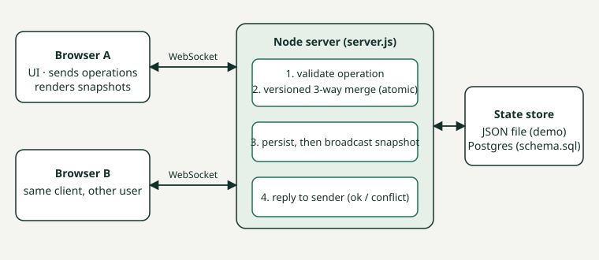
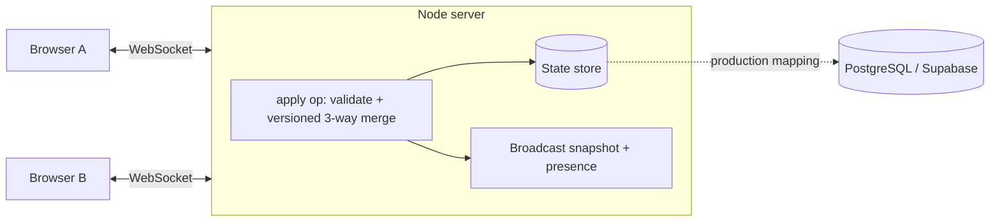

# Tandem — real-time collaborative project workspace
PS ID: ALG-WEB-01. Projects, tasks, assignment/status, comments, files, deadlines/progress, dashboard, live updates, and **no silent lost updates** on simultaneous edits.

## Run
```
npm install
npm start          # http://localhost:3000  (open two tabs, pick different users)
npm test           # 11 automated tests (server logic, WebSocket flow, two-client UI end-to-end)
```
Deploy: any Node host (Render, Railway, Fly). Needs WebSocket support; set `PORT` (and optionally `DATA_FILE`). `/health` is the health check.
A standalone, single-tab demo of the UI and conflict logic (no server) is also published as an artifact: https://claude.ai/artifact/LwpqNhwLNJtGrnB11ca84B

## Core workflow to demo
1. Tab A and tab B, different users. Create a project and task in A; it appears in B instantly.
2. Drag a card to another column in A; B updates and the card flashes. Dashboard numbers change in both.
3. **Conflict demo:** open the same task in both tabs. Change *assignee* in A, *deadline* in B, save both: both changes survive (field-level merge).
4. Now change the *title* in both tabs and save both. The second saver sees "Same field edited by someone else" and chooses theirs or mine. Nothing is overwritten until they choose.
5. Add comments and attach a file; they sync live. Stop the server mid-edit: the UI shows "reconnecting" and edits report an error instead of vanishing; on reconnect the client receives a full snapshot.

## Architecture


Equivalent Mermaid version:

- **Client** (`public/index.html`): vanilla JS, one file. Holds no authority: sends operations, renders whatever snapshot the server broadcasts.
- **Server** (`server.js`): `ws` + `http`. Every operation runs synchronously on Node's single thread, so each is atomic. State persists to `data.json` (atomic tmp+rename).
- **Schema** (`schema.sql`): the Postgres mapping, where the same check becomes `UPDATE ... WHERE id=$1 AND version=$2`.

### Key decisions
- **Field-level three-way merge + version numbers.** The client sends the snapshot it started editing from (`base`) and its changes. For each changed field: if nobody else touched it, apply; if someone changed it to the same value, apply; if someone changed it to a different value, report a conflict and write nothing. This keeps non-overlapping edits (the common case) friction-free while never silently dropping an overlapping one.
- **Resolution is version-pinned.** A "mine/theirs" choice is only honoured if the task is still at the version the person saw the conflict at; if a third edit landed, they are asked again.
- **Server authoritative, full-snapshot broadcast.** Simpler and self-healing: a dropped message or reconnect cannot leave a client diverged. Cost: payload grows with data (see limitations).
- **Broadcast before reply** so the sender's local state already contains its own change when the response resolves.
- **JSON store instead of Postgres by default** for zero-setup judging; the store is two functions (`persist`, `D`), and `schema.sql` documents the swap.

## Edge cases handled
Different-field edits merge; same-field conflict writes nothing; same-value concurrent edits are not conflicts; stale conflict resolution rejected; invalid status/field/empty title rejected; unknown or missing task; empty comment; oversized/non-data-URI files rejected; reconnect gets full state; live banner in an open dialog when the task changes underneath (UI test). Offline error messages exist in the code but are not covered by an automated test.

## Known limitations
- No authentication: user is a dropdown. Identity (`by`) is client-supplied and spoofable.
- Single server instance; scaling out needs a shared store plus pub/sub (Postgres LISTEN/NOTIFY or Redis).
- Full-state broadcast and base64 files inside state do not scale to large projects; files should move to object storage.
- No task/project deletion, no description-level text merge (description is merged as one field), no offline queue.
- UI tests run the real client in jsdom (a simulated browser), not in Chrome/Firefox, so layout, CSS, real drag-and-drop and mobile behaviour are untested. Nothing here has been load-tested.

## Future improvements
Auth (Supabase Auth/JWT), Postgres store, per-field operational transform or CRDT for descriptions, field-level presence ("Ben is editing the title"), delta broadcasts, deletion with tombstones, real-browser (Playwright) tests and load testing.

## Disclosure
- **AI-assisted:** this code, tests and README were generated with Claude (Anthropic) and reviewed/run by the team.
- **External:** npm package `ws` (MIT); Google Fonts (Bricolage Grotesque) loaded from fonts.googleapis.com. No external APIs or datasets; seed data is invented.

## Test evidence (`npm test`)
```
TAP version 13
# Subtest: edits to different fields are both kept (no lost update)
ok 1 - edits to different fields are both kept (no lost update)
# Subtest: same field edited concurrently -> conflict, nothing overwritten
ok 2 - same field edited concurrently -> conflict, nothing overwritten
# Subtest: conflict resolved with "mine" or "theirs" when version still current
ok 3 - conflict resolved with "mine" or "theirs" when version still current
# Subtest: stale resolution is rejected if a third edit landed meanwhile
ok 4 - stale resolution is rejected if a third edit landed meanwhile
# Subtest: two people setting the same value is not a conflict
ok 5 - two people setting the same value is not a conflict
# Subtest: validation: bad status, bad field, empty title, unknown task
ok 6 - validation: bad status, bad field, empty title, unknown task
# Subtest: comments, files and size limits
ok 7 - comments, files and size limits
# Subtest: live broadcast reaches other clients and replies reach the sender
ok 8 - live broadcast reaches other clients and replies reach the sender
# Subtest: reconnecting client receives full snapshot (recovery)
ok 9 - reconnecting client receives full snapshot (recovery)
# Subtest: two live UIs: merge, conflict prompt, resolution, live card update
ok 10 - two live UIs: merge, conflict prompt, resolution, live card update
# Subtest: creating a task in one UI appears in the other; drag-drop status change syncs
ok 11 - creating a task in one UI appears in the other; drag-drop status change syncs
1..11
# tests 11
# pass 11
# fail 0
# duration_ms 2438.039563
```
